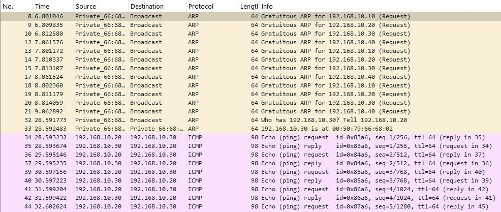
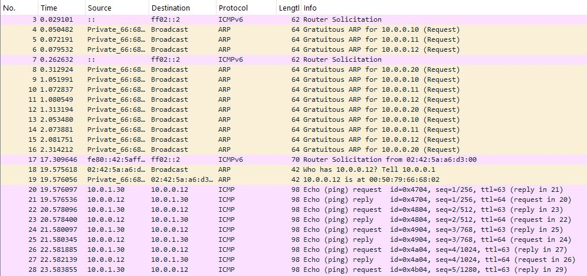
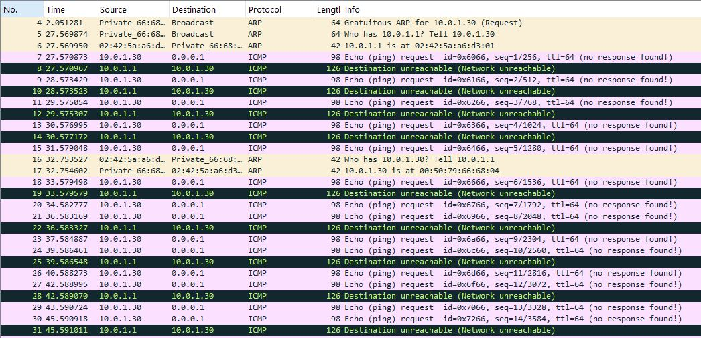
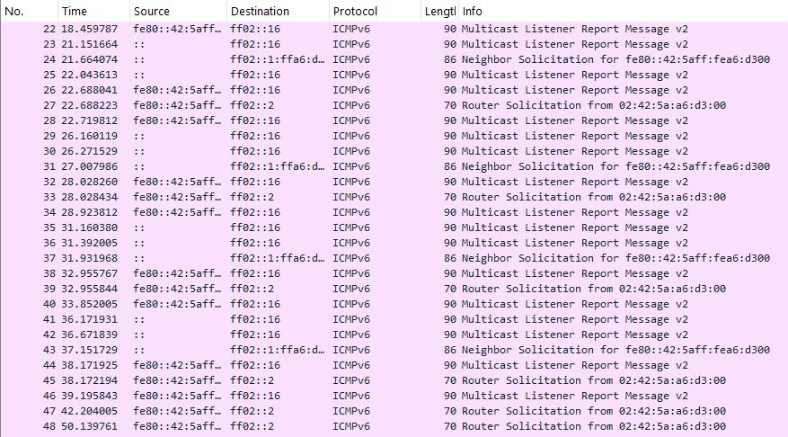

# Intelligent IoT Traffic Monitoring & Anomaly Detection System

An intelligent network traffic monitoring and anomaly detection system for IoT environments using Machine Learning, GNS3, Wireshark and Python.

---


---

## Project Overview

This project focuses on the design and implementation of a modular system capable of:

- Simulating IoT network environments
- Capturing and processing network traffic
- Detecting anomalous behaviours using Machine Learning
- Visualizing network metrics and alerts interactively

The system combines network simulation, traffic analysis and AI-based anomaly detection techniques to improve visibility and security in IoT environments.

---

## Objectives

The main objective of this project is to develop a modular and scalable system capable of detecting anomalous behaviour in IoT network environments through Machine Learning techniques.

The system aims to:
- Simulate realistic IoT traffic scenarios
- Capture and analyse network behaviour
- Identify abnormal traffic patterns
- Compare supervised and unsupervised ML approaches
- Provide interactive visualization tools for monitoring and analysis

---

## Main Technologies

- Python
- Machine Learning
- GNS3
- Wireshark / Tshark
- Streamlit
- Pandas
- Scikit-learn
- Network Traffic Analysis

---

## System Visuals

### Domestic IoT Topology


### Industrial IoT Topology


### Normal Traffic Monitoring


### Industrial Traffic Analysis


### Unreachable Destination Anomaly


### Simulated Reconnections Anomaly


---

## Features

- IoT network simulation
- Traffic capture and preprocessing
- Feature extraction
- Supervised anomaly detection
- Unsupervised anomaly detection
- Interactive visualization dashboard
- Modular architecture

---

## Project Status

Core architecture and traffic simulation environments have been completed.

Current work focuses on:
- Traffic preprocessing
- Feature engineering
- Machine Learning model evaluation
- Interactive dashboard integration

---

## Planned Architecture

```text
IoT Devices
     │
     ▼
GNS3 Simulated Network
     │
     ▼
Traffic Capture (Wireshark/TShark)
     │
     ▼
Data Processing Pipeline
     │
     ▼
Machine Learning Models
     │
     ▼
Interactive Dashboard (Streamlit)
```

---

## Repository Structure

```text
iot-anomaly-detection-system/
│
├── data/
├── notebooks/
├── src/
├── models/
├── captures/
├── dashboard/
├── docs/
├── images/
└── results/
```

---

## Future Improvements

- Real-time traffic monitoring
- Deployment with Docker containers
- Integration of additional anomaly detection models
- Support for MQTT and CoAP protocols
- Automated alert system
- Advanced analytics dashboard
- Scalable distributed architecture

---

## Author

Marta Parás
