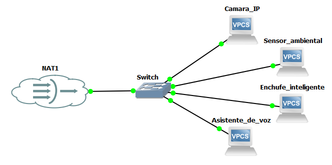
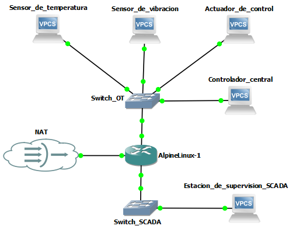
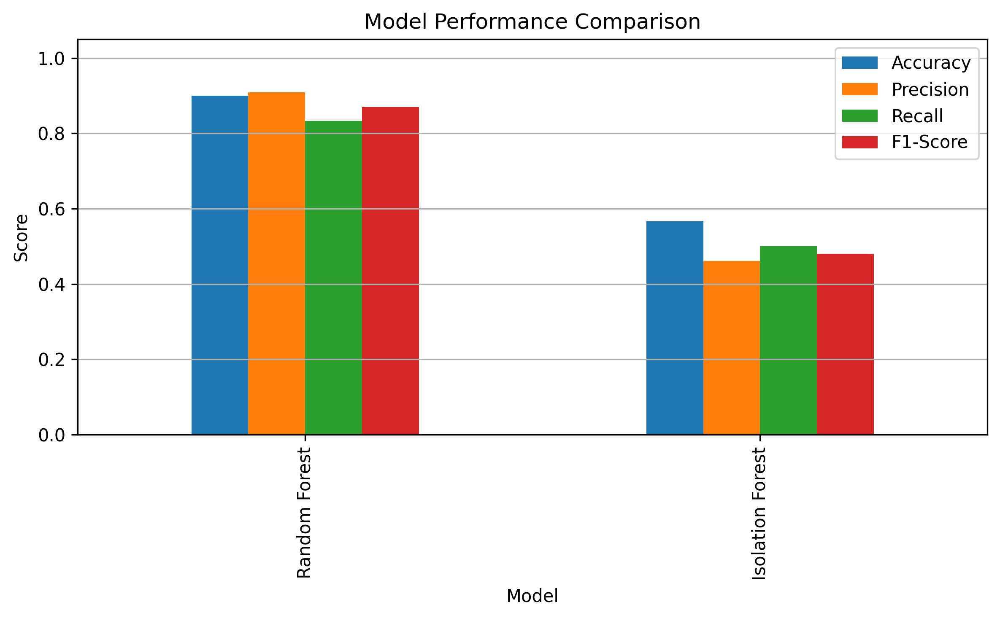
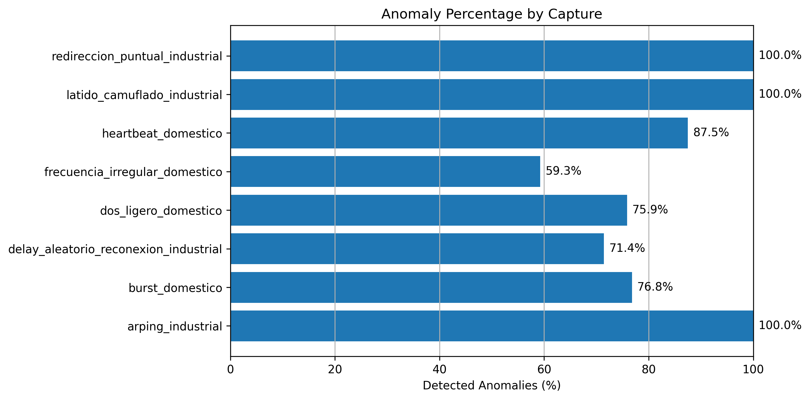
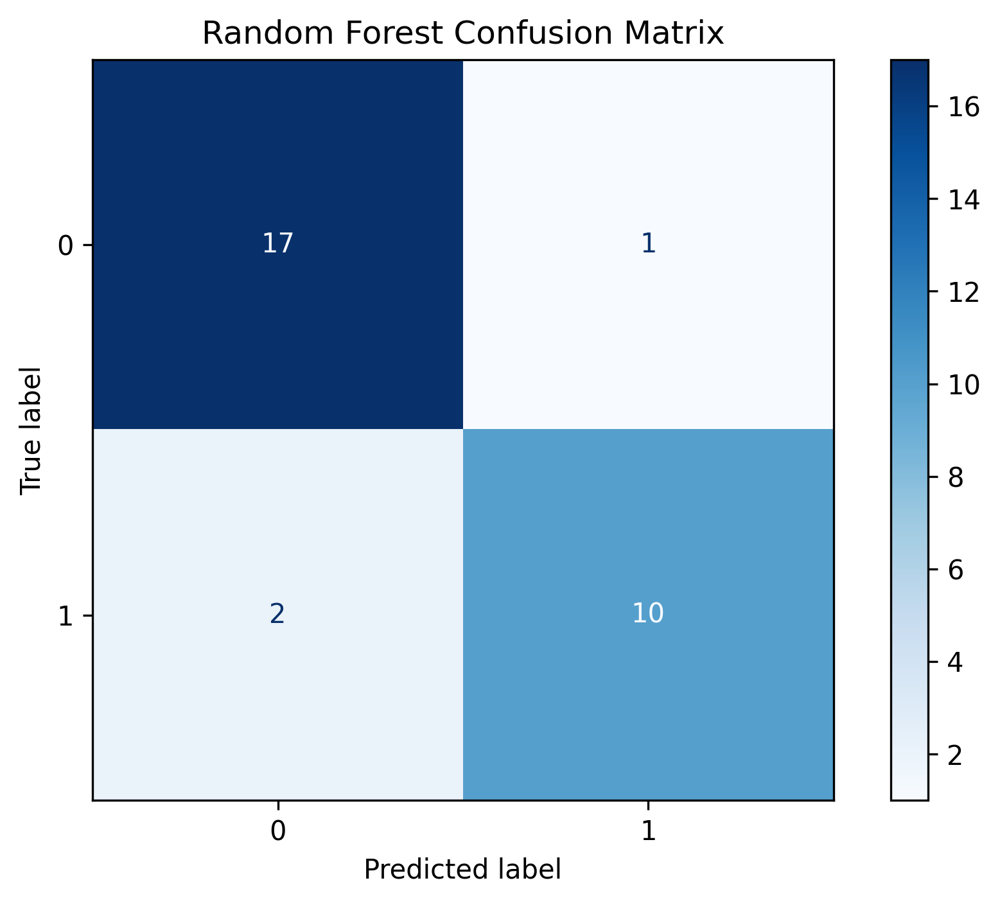

# Intelligent IoT Traffic Monitoring & Anomaly Detection System

An intelligent network traffic monitoring and anomaly detection system for IoT environments using Machine Learning, GNS3, Wireshark and Python.

---


---

## Project Overview

This project presents the design and implementation of a modular system for monitoring network traffic and detecting anomalies in simulated IoT environments.

The workflow integrates IoT network simulation, traffic capture, data preprocessing, feature extraction and Machine Learning techniques to analyse network behaviour and identify anomalous activity.

The project has been developed entirely in Python and includes an interactive dashboard for visualizing model performance and detection results.

---

## Objectives

The main objective of this project is to develop a modular and scalable system capable of detecting anomalous behaviour in IoT network environments through Machine Learning techniques.

The system aims to:

- Simulate realistic IoT traffic scenarios
- Capture and analyse network behaviour
- Identify abnormal traffic patterns
- Compare supervised and unsupervised ML approaches
- Provide interactive visualization tools for monitoring and analysis

---

## Technologies

- Python
- Machine Learning
- GNS3
- Wireshark / Tshark
- Streamlit
- Pandas
- Scikit-learn
- Matplotlib
- Network Traffic Analysis

---

## System Visuals

### Domestic IoT Topology


### Industrial IoT Topology


### Normal Traffic Monitoring


### Industrial Traffic Analysis


### Unreachable Destination Anomaly


### Simulated Reconnections Anomaly


---

## Generated Visualizations

### Model Comparison



### Anomaly Detection by Capture



### Random Forest Confusion Matrix



---

## Features

- IoT network simulation
- Traffic capture and preprocessing
- Feature extraction
- Supervised anomaly detection
- Unsupervised anomaly detection
- Automatic visualization generation
- Interactive Streamlit dashboard
- Modular architecture

---

## Project Status

The project has been completed and includes the full IoT traffic analysis pipeline:

- PCAP traffic processing
- Dataset preprocessing
- Statistical feature extraction
- Supervised and unsupervised Machine Learning
- Model evaluation
- Network anomaly detection
- Interactive Streamlit dashboard

---

## Project Workflow

```text
IoT Devices
     │
     ▼
GNS3 Simulated Network
     │
     ▼
Traffic Capture (Wireshark/TShark)
     │
     ▼
Data Processing Pipeline
     │
     ▼
Machine Learning Models
     │
     ▼
Interactive Dashboard (Streamlit)
```

---

## Repository Structure

```text
iot-anomaly-detection-system/
│
├── captures/
├── data/
├── images/
├── models/
├── notebooks/
├── results/
├── src/
│   ├── data_processing/
│   ├── detection/
│   ├── machine_learning/
│   ├── visualization/
│   ├── config.py
│   ├── utils.py
│   └── main.py
├── .gitignore
├── LICENSE
├── README.md
└── requirements.txt
```

---

## Installation

Clone the repository:

```bash
git clone https://github.com/Marta-Paras-Gutierrez/iot-anomaly-detection-system.git
cd iot-anomaly-detection-system
```

Create a virtual environment (recommended):

```bash
python -m venv .venv
```

Activate the virtual environment.

**Windows**

```bash
.venv\Scripts\activate
```

**Linux / macOS**

```bash
source .venv/bin/activate
```

Install the project dependencies:

```bash
pip install -r requirements.txt
```

---

## Usage

The project includes a console application that allows executing each stage of the pipeline independently or running the complete workflow.

Launch the main menu:

```bash
python -m src.main
```

Alternatively, the interactive dashboard can be started directly:

```bash
streamlit run src/visualization/dashboard.py
```

The available modules include:

- PCAP processing
- Dataset preprocessing
- Feature extraction
- Machine Learning model training
- Model evaluation
- Traffic anomaly detection
- Visualization generation
- Interactive dashboard

---

## Future Improvements

Possible future extensions include:

- Real-time traffic monitoring
- Support for additional IoT protocols
- Deep Learning-based anomaly detection
- Docker deployment
- Automated alert generation

---

## License

This project is licensed under the MIT License. See the [LICENSE](LICENSE) file for further details.

---

## Author

**Marta Parás**
